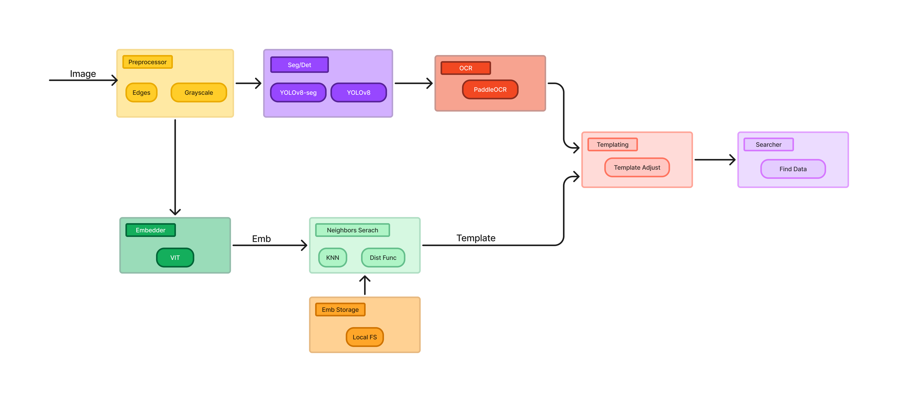
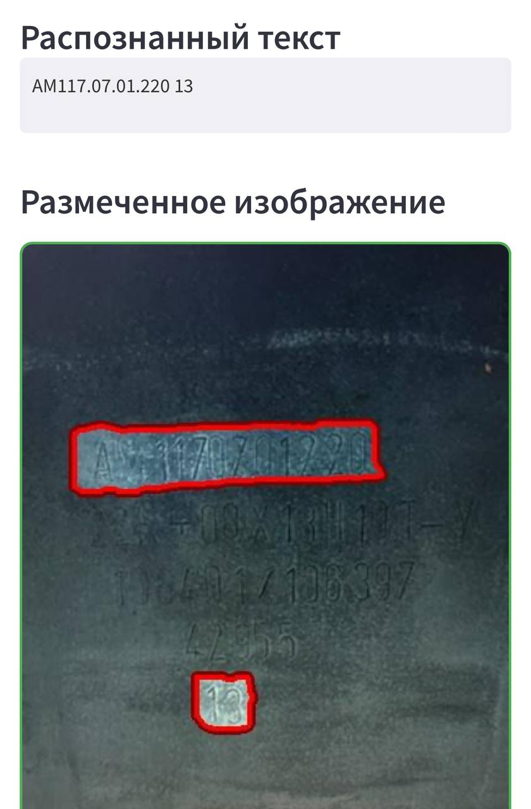
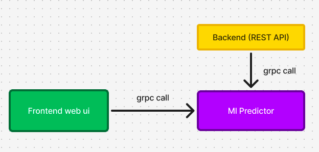

# 👨🏻‍💻 Цифровой прорыв, 2024

## 🙋🏻‍♂️ Решение команды misis total timbudon | 2 место 
## ⚛️ Кейс интеллектуальная система распознавания маркировки

### О сервисе

Сервис позволяет получать маркировку по фотографии детали, а так же производить поиск по распознанным данным из таблицы с заказами 

#### [Ссылка на сервис](https://timbudonmetalstamps.ru:8000/)

### Архитектура решения

#### Ml Predictor

Является сервисом для получения маркивровки по фотографии детали и поиска детали по имеющимся данным. В качестве модели распознавания используется PaddleOCR. Для метчинга с имеющимися деталями используется visual transformer. Подробная архитектура решения приведена снизу. Взаимодействие осуществляется с помощью протокола gRPC

Стек: PaddleOCR, OpenCV, Python, gRPC

#### Backend

Дает доступ к системе извне через REST. Имеется возможность подключения 1С сервера при помощи протокла odata.

Стек: Python, FastAPI, odata, gRPC

#### Frontend

Реализован на streamlit с адаптивным интерфейсом под разные устройства. Имеется возможность сделать фотографию или загрузить готовую с устройства и получить результат инференса модели.

Стек: Python, streamlit

#### Общая архитектура

#### Деплой

Происходит при помощи nginx, код для деплоя находится в ветке deploy

Стек: nginx, docker, docker compose 

#### Полный запуск пайплайна

Находится в файле в `FULL_LAUNCH.ipynb`

### Запуск приложения

1. Заполнить файл `.env` по примеру из `.env.example`
2. `make docker_up_d`
3. фронтенд доступен на http://localhost:8501

### Почему лучше других решений?
- Динамическое улучшение качестве за счет хранения успешных инференсов
- Топ 1 на лидерборде по метрике, на 0.05 превосходит другие решения

Улучшения:
- БД для быстрого поиска детали
- Object Storage для хранения фотографий
- Автоматическое исправление дисторций фотографий 

## Описание папок

Название папки = запускаемый сервис, более подробно см. архитектуру

### Состав команды

1. Николай Александров - ML Engineer
2. Сергей Мартынов - Ml Engineer 
3. Роман Шинкаренко - Ml Engineer, Backend
4. Артем Цыканов - Ml Engineer, Frontend, Backend
5. Иван Плешаков - Ml Engineer
